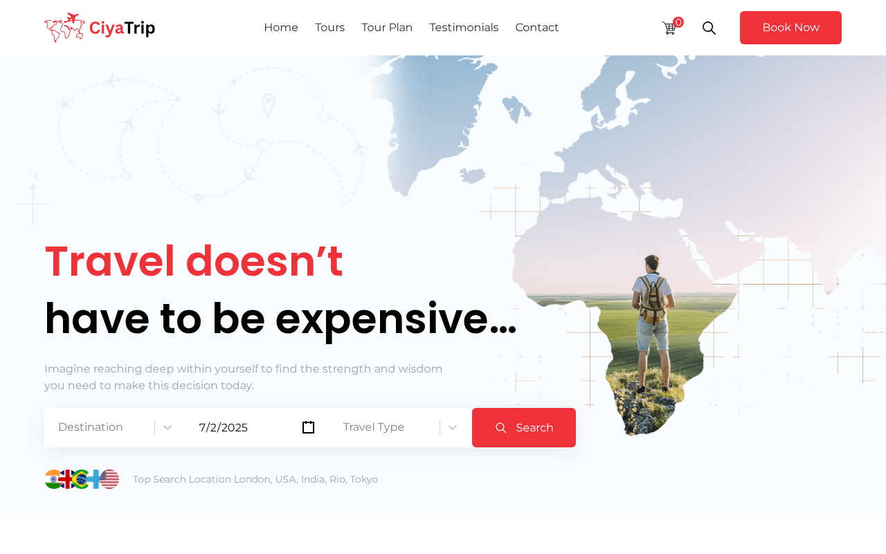

# 🌍 CiyaTrip — Travel & Tour Booking Website

🔗 **Live Preview:** [Visit the Live Site](https://ciyatrip.vercel.app/)

**CiyaTrip** is a modern travel and tourism web application built with **React + Vite**. It allows users to explore top destinations, view detailed trip plans, and make travel bookings — all through a sleek, responsive, and interactive interface.

## 📸 Project Screenshot

/public/preview.jpg
```


---

## 🚀 Features

- 🇺🇳 World tour destinations with country flags
- 📆 Day-wise travel plan display
- 🖼️ Beautiful gallery and testimonial sections
- 📍 Interactive map with location pins
- 🎯 Scroll-to-top button
- ⚡ Built using Vite for lightning-fast development

---

## 🛠️ Built With

- [React](https://react.dev/)
- [Vite](https://vitejs.dev/)
- [React Icons](https://react-icons.github.io/react-icons/)
- [Tailwind](https://tailwindcss.com/)

---

## 🧪 Getting Started

### Step 1: Clone the repository
```bash
git clone https://github.com/jawadelachhab/ciya-trip-react-ts.git
cd ciya-trip-react-ts
```

### Step 2: Install dependencies
```bash
npm install
```

### Step 3: Run the development server
```bash
npm run dev
```

### Step 4: Build for production
```bash
npm run build
```

---

## 🙌 Support This Project

If you like this project, consider giving it a ⭐ on GitHub and following the account for more awesome projects!

[👉 Follow me on GitHub](https://github.com/jawadelachhab)  
[⭐ Star this repository](https://github.com/jawadelachhab/ciya-trip-react-ts)

Thank you for your support! ❤️
